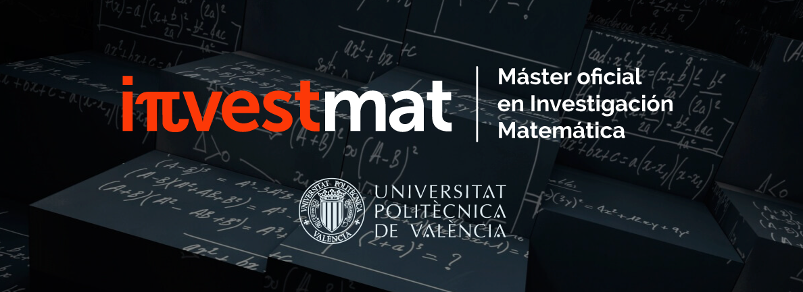

# INVESTMAT Repository

## Overview
INVESTMAT is a specialized repository encompassing a vast range of academic content and developmental resources associated with the **Master of Science in Applied Mathematics program**. Originating from a collaboration between the University of Valencia and the Polytechnic University of Valencia (UPV), it is a pivotal platform aimed at prospective students, academic researchers, and enthusiasts in Applied Mathematics, offering a plethora of insightful resources and materials.

## Affiliated Institutions
- [University of Valencia](https://www.uv.es)
- [Polytechnic University of Valencia (UPV)](https://www.upv.es/en)

## Program Duration
September 2023 - June 2024

## Collaborative Program
The repository revolves around the UPV-UV Interuniversity Doctorate in Mathematics, renowned for its academic excellence and comprehensive approach in the domain of mathematics.

## Relevant Coursework

| University                     | Course Type | Course Name                                                              | Translation (English)                                      | Link                            |
|--------------------------------|-------------|---------------------------------------------------------------------------|------------------------------------------------------------|---------------------------------|
| Universitat Politècnica de València | (obl)       | Modelización matemática en la Industria                                   | Mathematical Modeling in Industry                          | [📂](courses/MatInd/index.html)      |
|                                | (obl)       | Herramientas metodológicas en la investigación matemática                 | Methodological Tools in Mathematical Research              | [📂](courses/HerMat/index.html)      |
|                                | (opt)       | Métodos numéricos en Ingeniería: Ecuaciones diferenciales y en derivadas parciales | Numerical Methods in Engineering: Differential and Partial Differential Equations | [📂](courses/EdoEdp/index.html) |
| Universitat de València        | (obl)       | Iniciación a la investigación matemática                                  | Introduction to Mathematical Research                     | [📂](courses/InvMat/index.html)      |
|                                | (obl)       | Fundamentos de matemática avanzada                                        | Foundations of Advanced Mathematics                       | [📂](courses/MatFun/index.html)      |
|                                | (opt)       | Fundamentos geométricos de diseño con ordenador                           | Geometric Foundations of Computer Design                  | [📂](courses/FGDO/index.html)      |

## Skills Acquired
- Mathematics
- Mathematical Modeling
- Applied Mathematics
- Mathematical Analysis

## Objective
INVESTMAT seeks to serve as an essential academic hub, propelling learning experiences by providing an exhaustive array of scholarly articles, practical applications, research papers, and course materials pertinent to the diverse spectrum of Applied Mathematics.

## Usefulness
INVESTMAT is designed to meet the academic and research-oriented needs of students and researchers alike, providing extensive content in the multifarious field of mathematics.

## Access
Open for educational purposes, INVESTMAT is committed to contributing to the global learning ecosystem with the scholarly advancements and research innovations realized in the Applied Mathematics program at the University of Valencia and the Polytechnic University of Valencia (UPV).

